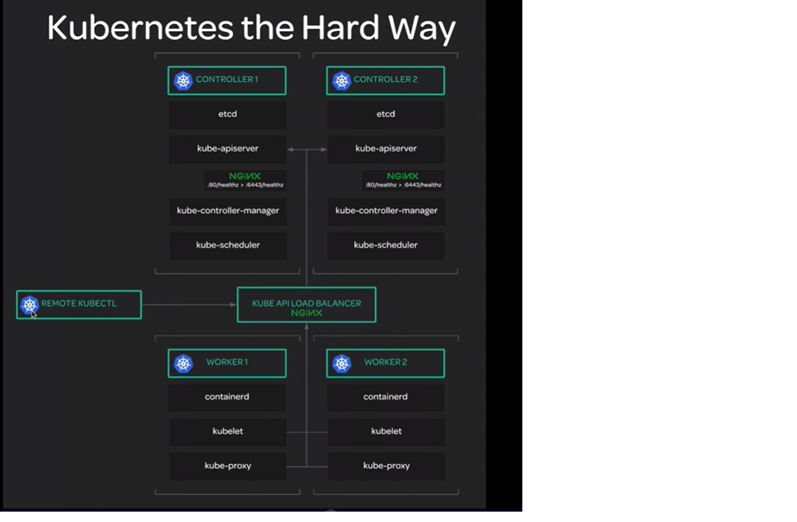

# Kubernetes The Hard Way
---

## Introduction

This project follows the original [kubernetes the hard way](https://github.com/kelseyhightower/kubernetes-the-hard-way) guide, which explains
how to set up a kubernetes cluster from scratch - i.e. - manually create all the certificates,
kubeconfigs, and setup the kubernetes binaries and services on the nodes, instead of using an
installer such as kubeadm, minikube, etc.

This project is a bunch of scripts that implement the original guide in an automatic manner. The user
fills in the details about his infrastructure (i.e. node IP addresses, etc) in a JSON file,
and the scripts will go on and bootstrap a kubernetes cluster on the user's infrastructure.

## Cluster Architecture
The original guide guides you to set up a cluster with 3 controllers and 3 worker nodes.
In a multi-controller cluster, we also need a load balancer to load-balance traffic between
the controller nodes.

In our project, you can set up (virtually) as many controllers and workers you like.
If you choose to set up a multi-controller cluster, you'll need to take care of the 
load balancer yourself (More details in the User Guide page), and just provide the IP of this load balancer.

### Controller Nodes
on each controller node, we have the following components:
* etcd
* kube-apiserver
* kube-scheduler
* kube-controller-manager

### Worker Nodes
on each worker node, we have the following componets:
* containerd
* kubelet
* kube-proxy

## Project Architecture

The project is built so that for each step in the bootstraping
process there's a directory containing all the files needed to perform this step.
So for example the `certificates` directory contains everything's needed to create
all the certificates needed in order to run our cluster.

The steps for bootstraping the cluster are:
1. Generate certificates
2. Generate kubeconfigs
3. Install and run etcd on controller nodes
4. Install and run kubernetes components on controller nodes
5. Install and run a container runtime and kubernetes components on worker nodes
6. Configure netwokring and DNS in the cluster

Each step has its own directory in the project's source tree which is responsible of performing
this step. This directory contains either a Makefile or a bash script which does the heavy lifting.

See the [Technical Details](./docs.TECHNICAL.md) page for further details.

## Usage

See the User Guide page for instructions about how to use this tool.
