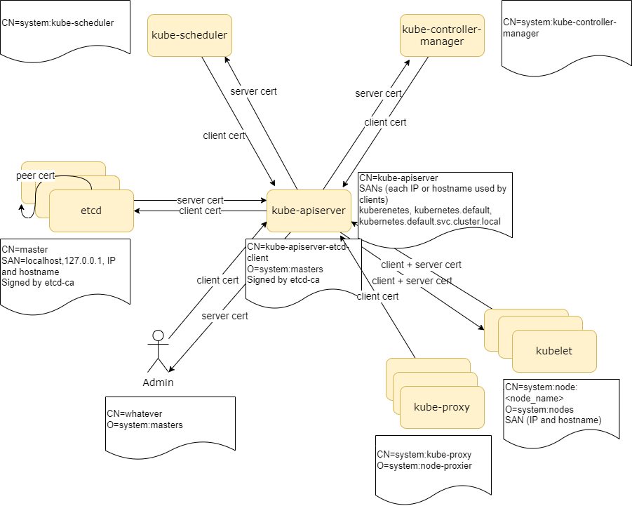

# Certifiates
---

In this section, we're generating a bunch of TLS certificates to be used by the different parts
of the kubernetes cluster.

## CAs
We generate 2 CAs:
* kubernetes-ca - used to sign all the certificates in the cluster
* etcd-ca - used to sign all the etcd-related certificates

## Certificates
First, we generate a CA certificate that will be used across the cluster.
Then, we generate the certificates.

Overall, we generate the following certificates:
* admin - client certificate for cluster administrators
* kube-controller-manager - client certificate for the kube-controller-manager to talk to the apiserver
* A client certificate for each kubelet to talk to the apiserver. This is used also as a server certificate by the kubelet,
    and thus must contain the IP and hostname of each node.
* kube-proxy - client certificate for the kube-proxy to talk to the apiserver
* kube-scheduler - client certificate to talk to the apiserver
* apiserver-kubelet-client - client certificate for the apiserver to talk to the kubelets
* apiserver-etcd-client - client certificate for the apiserver to talk to etcd.
* etcd-server - for each controller, a server certificate for etcd. Also used. Signed by the etcd-ca
as the `peer-certificate`. Signed by the etcd-ca
* kube-apiserver - a server certificate for the apiserver.

## Service Account Key Pair
Kubernetes uses a key pair to generate service account tokens.
So we need to create a certificate for that also.

## Graphical view




## Usage
---
We rely on having the `data.json` file in the root directory of `kthw`.  This includes the list of worker nodes, the cluster name, 
the IP of the API server, etc.

Use the Makefile to generate the certificates:
```
$ make all
```

## Notes
---

It is possible to write several IPs for the API server in the `data.json` file. All these IPs will be included as `subjectAlNames` in the certificate of the API server, so that it will be possible to access the API with each of them.


